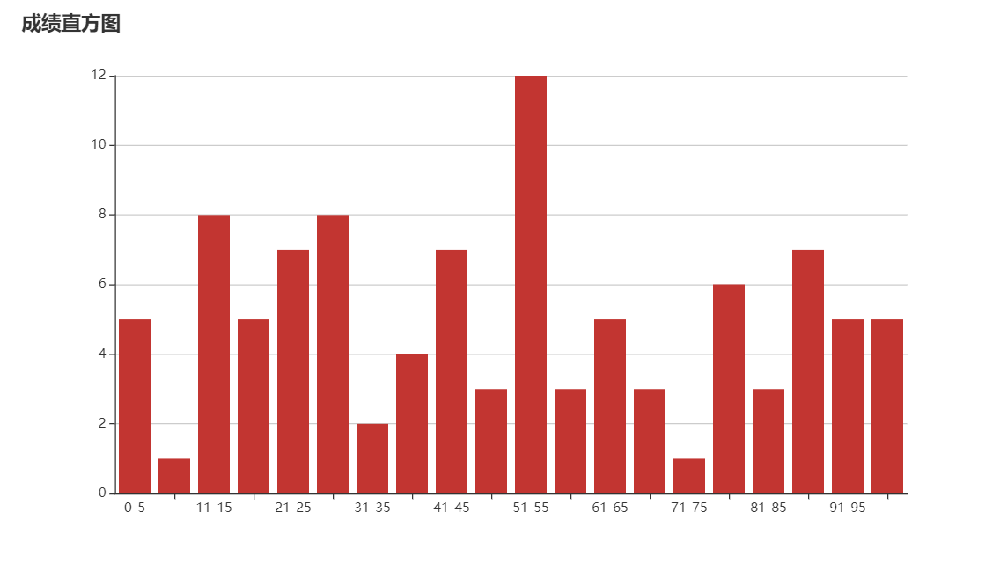

# 机器学习与数据挖掘作业

### 作业信息

#### 组员信息

组长：严伟聪

组员：陈志潮，杨海龙

#### 分工

实验一、二：严伟聪

实验三：陈志潮、杨海龙

#### 作业题目

实验一、二、三

#### 作业环境

实验一、二：golang1.14 代码与相关文件位于test1and2文件夹中

实验三：C++ 代码位于test3文件夹中

实验1、2、3结果截图统一存放在assets文件夹中

## 实验1、2代码解释

代码和相关文件位于test1and2文件夹中，实验100条数据由随机函数生成并存放在数据库（mysql）中，文本数据有10条存放在student.txt，（做的时候没有看到群上有文件所以就自己随机生成数据了） 合并规则如下：按名字相同的合并，除了成绩和string学号之外的信息按照数据库的信息，成绩取数据库数据和文本数据的平均，string学号取txt文本数据。

实验一：整合数据函数是`InteData()`  数据分析函数是`analysis()`

实验二：输出散点图函数是`outputScatter()` 输出直方图的函数是`outputBar()` 计算并输出zscore归一化矩阵的函数是`zscore(finalInfo)`   散点图生成在scatter.html文件中，直方图生成在bar.html文件中

详细细节在代码注释里面

## 实验1、2结果

整合的数据，数据分析以及z-score归一化矩阵输出

.png)

.png)

.png)

.png)

.png)

散点图

直方图

## 实验3代码解释

实验三的z-score归一化矩阵由随机函数随机生成

生成随机数函数是`createdata()`   聚类实现函数`k_means_Calculate()`

详细细节在代码注释里面

## 实验3结果

.jpg)

.jpg)

.jpg)